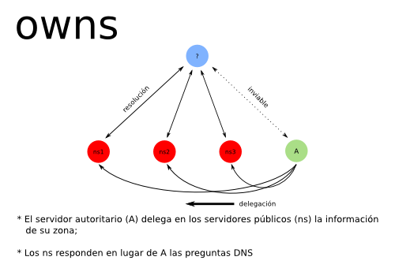

# owns

Las computadoras personales conectadas a Internet son consideradas
_terminales_.  Por lo tanto, no se espera que sean accedidas
públicamente, ni que actúen como servidores.  Uno de los problemas con
el que se enfrentan es no poseer un nombre legible por humanos, es decir
un nombre de dominio.  Esto se dificulta al no poseer, en la mayoría de
los casos, lo que se denomina una _dirección IP estática_.

Existen diversas soluciones a este problema, como los _DNS dinámicos_,
que permiten a sus terminales clientes actualizar su dirección IP
siempre cambiante de forma que puedan ser accedidas a través de un
nombre de dominio.

Sin embargo, estos proveedores suelen tener limitaciones en la cantidad
y tipo de registros DNS permitidos.

La idea de **owns** es que cada terminal sea su propio servidor de DNS
autoritario.

Los servidores DNS son capaces de comunicarse entre sí y transferirse
las zonas DNS, es decir un dominio con sus subdominios y registros
asociados.  El servidor raíz (el origen) de una zona se llama _servidor
autoritario_, es decir que tiene autoridad sobre todo lo que sucede en
su zona y es al que los servidores DNS _recursivos_ consultan cuando se
intenta resolver un nombre de dominio.

Owns permite a estas _terminales_ ser su propio servidor autoritario,
aprovechando esta capacidad de transferencia entre servidores para
delegarles a otros servidores públicos la información de su(s) zona(s).

La delegación a estos servidores _esclavos_ es necesaria e importante
porque al carecer de direcciones estáticas, los servidores autoritarios
no pueden ser consultados normalmente por sus registros.  En cambio, si
los delegan a servidores accesibles desde direcciones únicas, el resto
de Internet sigue funcionando normalmente.  Lo que cambia es que estos
servidores públicos no son la autoridad sobre la zona, sino que actúan
de delegados de los otros servidores.

En conclusión, podemos administrar nuestras propias zonas, sin límites
artificiales más que los de los estándares de DNS y delegar en otros la
tarea de difundir esta información.

